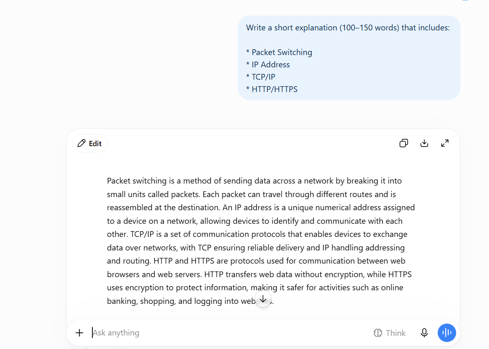
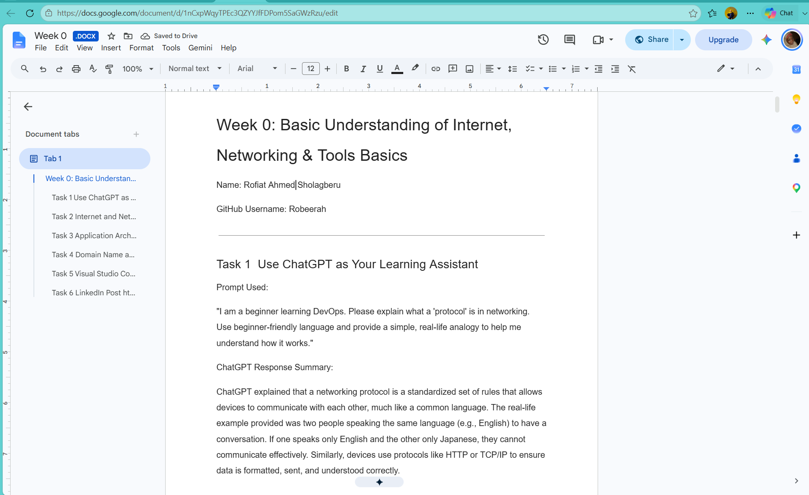
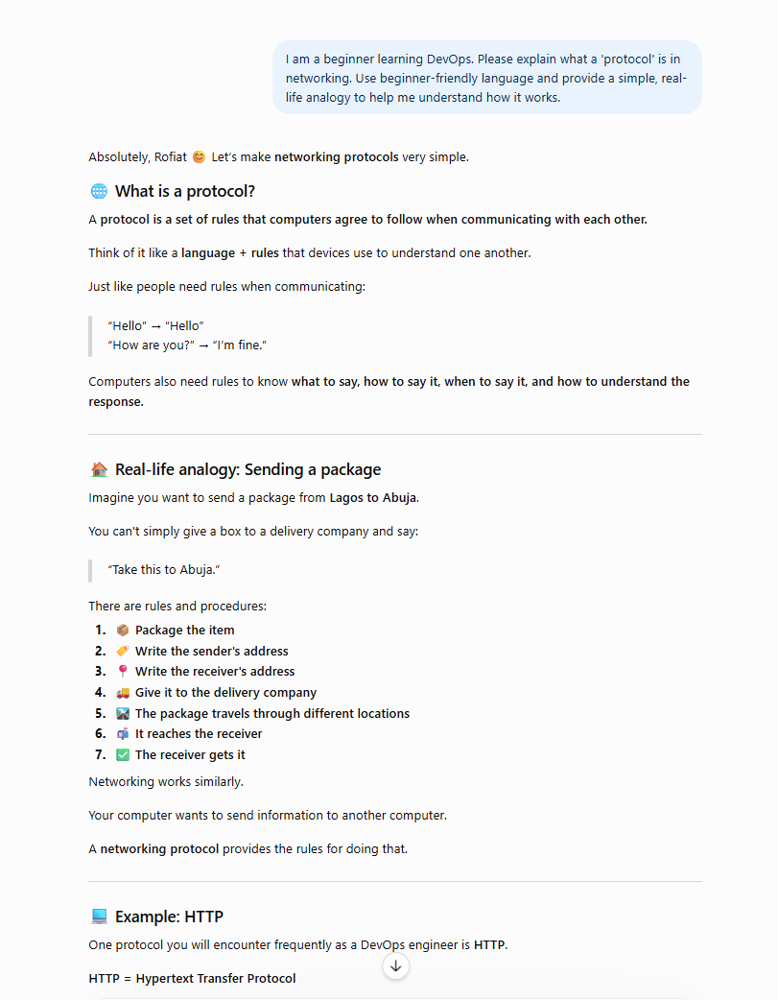
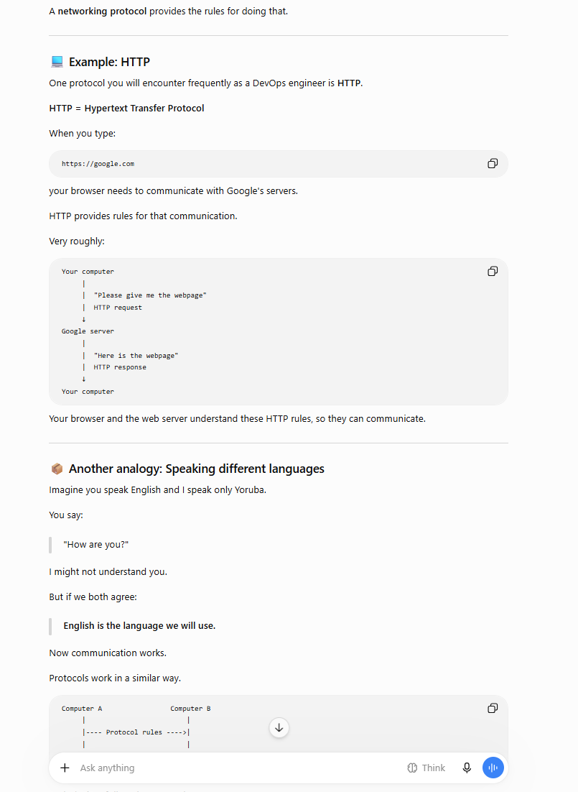
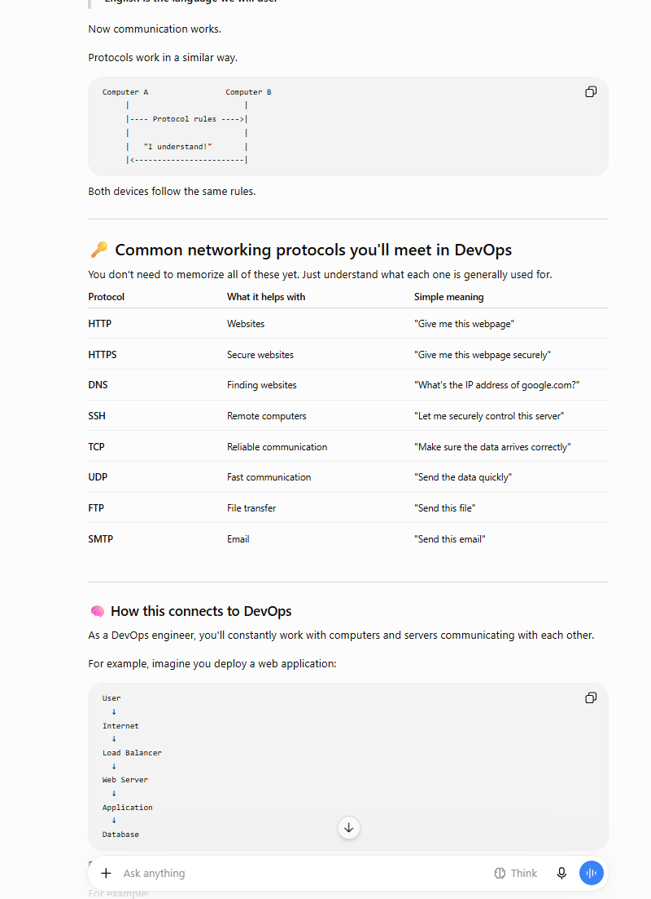
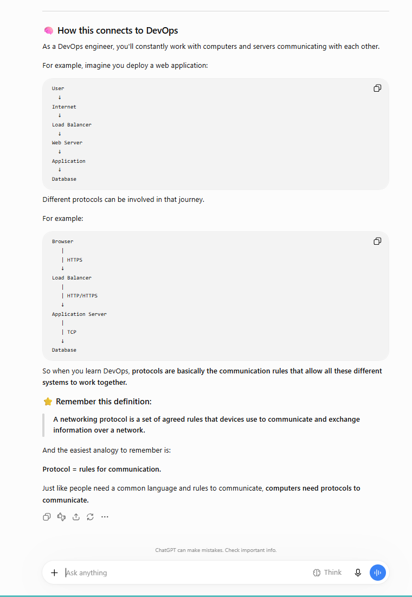
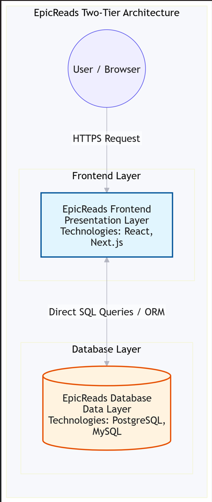
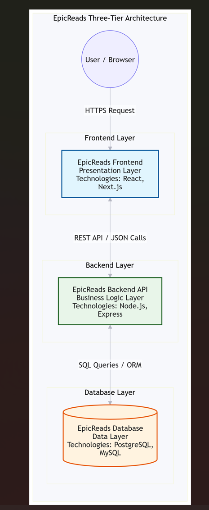
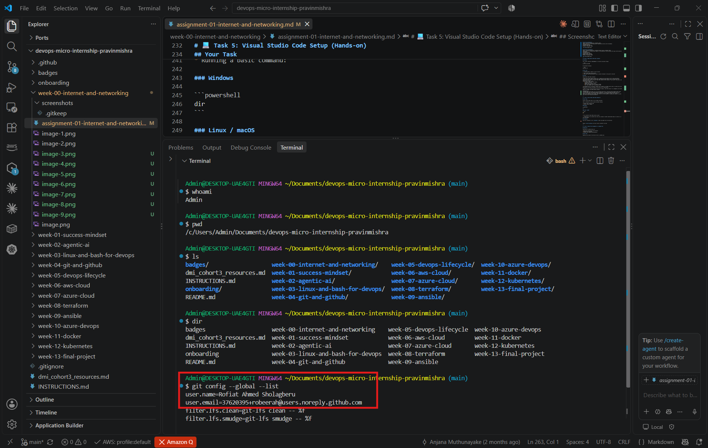
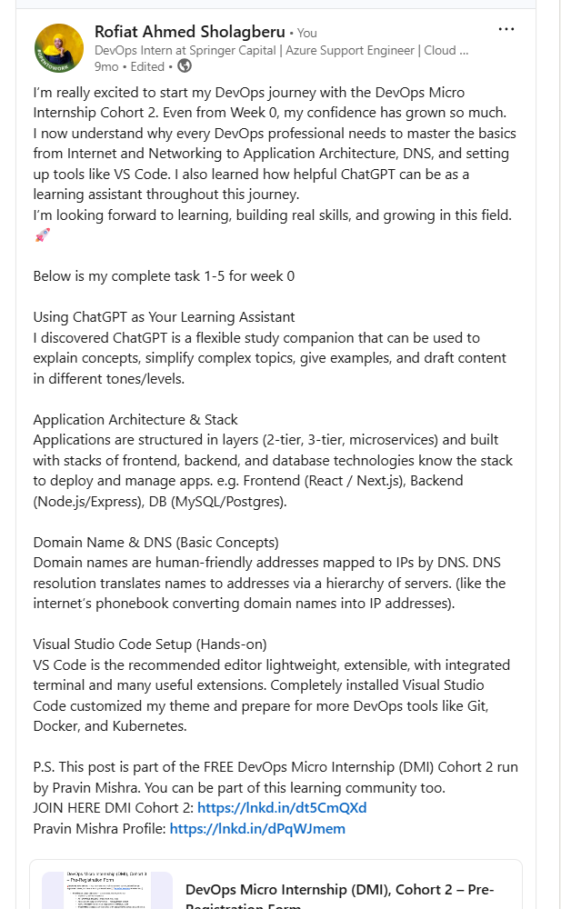

# Week 00 - Internet and Networking

Part of the DevOps Micro Internship (DMI) Cohort 3 with Agentic AI

---

# 🧑‍💻 Task 1: Using ChatGPT as Your Learning Assistant

## Scenario

You're new to DevOps and will frequently encounter technical questions. ChatGPT can be your learning companion.

## Your Task

Write a clear ChatGPT prompt to help you understand:

> "What is a protocol in networking? Explain with a simple real-life example."

Take a screenshot of your interaction showing:

* Your detailed prompt (with clear expectations)
* ChatGPT's simplified response with an example

## Screenshot

Save your screenshot in the `screenshots` folder and update the file name below.




Replace `task-1-chatgpt.png` with your actual screenshot file name.


---

## What I Learned (2–3 lines)

**Using ChatGPT as Your Learning Assistant**

Purpose: Use ChatGPT to clarify concepts, get step-by-step examples, and draft explanations in simple language.

How to ask and prompt properly: Tell ChatGPT who you are (novice/experienced), what format you want (summary, checklist, example), and any constraints (length, tone).

Example prompt: “I’m learning DevOps as a beginner. Explain packet switching in simple terms and give a short real-world analogy.”

Best practice: Ask follow-ups when unclear, request examples or diagrams, and use ChatGPT to draft answers you then personalize.

## Answer

**Prompt Used:**
"I am a beginner learning DevOps. Please explain what a 'protocol' is in networking. Use beginner-friendly language and provide a simple, real-life analogy to help me understand how it works."
ChatGPT Response Summary:
ChatGPT explained that a networking protocol is a standardized set of rules that allows devices to communicate with each other, much like a common language. The real-life example provided was two people speaking the same language (e.g., English) to have a conversation. If one speaks only English and the other only Japanese, they cannot communicate effectively. Similarly, devices use protocols like HTTP or TCP/IP to ensure data is formatted, sent, and understood correctly.





---

# 🌐 Task 2: Internet and Networking

## Scenario

Your friend is launching an online bookstore named **EpicReads**.

He asked you to explain how users globally can access his website hosted in Finland.

## Your Task

Write a short explanation (**100–150 words**) that includes:

* Packet Switching
* IP Address
* TCP/IP
* HTTP/HTTPS

💡 **Tip:** You may use ChatGPT (as demonstrated in Task 1) to refine your explanation.

## Answer

**Internet and Networking**

Definition: The Internet is a global network of networks that lets devices exchange data.
Packet switching: Data is split into small packets; packets can travel different routes and are reassembled at the destination this increases efficiency and resilience.

**Key protocols:**
IP (Internet Protocol): Provides addressing and routing; devices and servers have unique IP addresses.

TCP (Transmission Control Protocol): Ensures reliable, ordered delivery; retransmits lost packets.

UDP (User Datagram Protocol): Connectionless, lower-latency—used for real-time audio/video where speed matters more than perfect reliability.

HTTP/HTTPS: Web protocols; HTTPS encrypts traffic for confidentiality and integrity.

Ports: Numeric entry points on a server that identify services (e.g., HTTP 80, HTTPS 443, SSH 22). Multiple apps can run on one IP using different ports.

Practical DevOps note: Troubleshooting often involves checking IP reachability, port availability, protocol behavior, and firewall rules.

**Explanation:**
When a user in the USA accesses the EpicReads website hosted in Finland, their browser initiates a request using the HTTP/HTTPS protocol, ensuring the data is encrypted and secure. This request is broken down into smaller data chunks through packet switching, allowing these packets to travel efficiently across various global network routes and reassemble at the destination. Each device, including the user's computer and the Finnish server, is identified by a unique IP address, ensuring the data reaches the correct location. The TCP/IP protocol suite manages this entire process, with TCP guaranteeing that all packets arrive reliably and in the correct order, while IP handles the addressing and routing across the internet.


---

# 🏗️ Task 3: Application Architecture & Stack

## Scenario

EpicReads bookstore has two application versions:

### Two-Tier Application

* Frontend
* Database

### Three-Tier Application

* Frontend
* Backend
* Database

## Your Task

* Draw simple diagrams (hand-drawn or tool-based such as draw.io)
* Label each layer clearly
* List at least two common technologies or tools used for each layer
* Submit a screenshot or photo clearly showing your own drawing

## Diagram Screenshot / Photo

---

## Technologies Used

### Frontend

* Frontend: React, Next.js, CSS frameworks.

### Backend

* Backend: Node.js, Express (APIs/business logic).

### Database

* Database: MySQL, PostgreSQL; ORMs or query libraries.

### Application Architecture & Stack

## Common architectures:

* Two-tier: Presentation (frontend) and database. Simpler, direct frontend-to-database interaction.
* Three-tier: Presentation (frontend), Business Logic (backend), Database. More modular and maintainable.
* Microservices: Frontend interacts with many small services (user, inventory, orders, payments), often with separate databases better for scaling and independent deployments.

Example apps used in the course: book-reviews (three-tier), React app (two-tier), static mini-finance site, monolith (epic books).

## Tech stack examples per layer:

* Frontend: React, Next.js, CSS frameworks.
* Backend: Node.js, Express (APIs/business logic).
* Database: MySQL, PostgreSQL; ORMs or query libraries.

DevOps relevance: Know which technologies are used so you can install/configure dependencies, open correct ports, and set up deployment pipelines.

## Two-Tier Architecture:
Layers: Frontend (Presentation) ↔ Database (Data)
Communication: The frontend application communicates directly with the database.
Technology Examples:
Frontend: React, Next.js
Database: PostgreSQL, MySQL




## Three-Tier Architecture:
Layers: Frontend (Presentation) ↔ Backend (Business Logic) ↔ Database (Data)
Communication: The frontend sends requests to the backend API, which processes the logic and then queries the database.
Technology Examples:
Frontend: React, Next.js
Backend: Node.js, Express
Database: PostgreSQL, MySQL


---

# 🌍 Task 4: Domain Name & DNS (Basic Concepts)

## Scenario

Your friend's bookstore **EpicReads** is currently accessible through:

```text
52.172.142.222:3000
```

He purchased the domain:

```text
epicreads.com
```

## Your Task

In **50–100 words**, explain in your own words:

1. What is DNS (Domain Name System)?
2. Which DNS record type should be used to connect the domain to the given IP, and why?

## Answer

Domain Name & DNS (Basic Concepts)

* Domain name: Human-readable address (e.g., example.com) used instead of IP for ease and branding.
* DNS (Domain Name System): The Internet’s phone book—translates domain names to IP addresses via a resolution process involving browser cache, DNS resolvers (ISP or public), root servers, TLD servers, and authoritative servers.
* DNS records (common types):
    * A: maps a name to an IPv4 address.
    * AAAA: maps to IPv6.
    * CNAME: alias to another domain.
    * MX: mail exchange records for email routing.
    * TXT: text records (e.g., verification, SPF).

* How mapping works: You register a domain with a registrar, set DNS records (often in a DNS service like AWS Route 53), and point the domain to the server IP or load balancer.

* DevOps note: If a service works by IP but not by domain, check DNS records, TTL, propagation, and record types (A vs CNAME), plus DNS resolver caching.

**Explanation:**
The Domain Name System (DNS) acts as the internet’s phone book, translating human-readable domain names (like epicreads.com) into machine-readable IP addresses. To connect the domain epicreads.com to the specific IPv4 address 52.172.142.222, your friend must use an A (Address) record. An A record is specifically designed to map a domain name directly to an IPv4 address, allowing user browsers to locate the correct server hosting the bookstore.

---

# 💻 Task 5: Visual Studio Code Setup (Hands-on)

## Your Task

Install Visual Studio Code (if not already installed).

Take a screenshot of your VS Code environment showing:

* Terminal open inside VS Code
* Running a basic command:

### Windows

```powershell
dir
```

### Linux / macOS

```bash
pwd
ls
```

* Your selected VS Code theme clearly visible

⚠️ **Important:** The screenshot must show your username or another identifiable detail to confirm it is your environment.

## Screenshot

**Setup Verification:**
I have successfully installed Visual Studio Code and customized the interface with a dark theme for better readability. I opened the integrated terminal (Terminal → New Terminal) and ran basic OS commands to verify my environment.
Command run: whoami (to verify my username)
Command run: pwd (to show my current directory)
Command run: dir or ls (to list directory contents)



---

# 🔗 Task 6: Publish Your Assignment as a LinkedIn Post

## Objective

Publishing on LinkedIn helps you:

* Build your professional online presence
* Reinforce your learning
* Document your DevOps journey publicly

## Your Task

Summarize your answers from Tasks 1–5 into a LinkedIn post.

Clearly structure your post into the following sections:

* ChatGPT
* Internet & Networking
* App Architecture
* DNS
* VS Code Setup

Add the following credit note at the end of your post:

> **P.S. This post is part of the DevOps Micro Internship (DMI) with Agentic AI — Cohort 3 — by Pravin Mishra. My graded progress is public: https://dmi.pravinmishra.com/s/YOUR-GITHUB-USERNAME.html · Start your DevOps journey: https://dmi.pravinmishra.com/?utm_source=student&utm_medium=ps-linkedin&utm_campaign=cohort3**

---

## LinkedIn Post URL

Paste your LinkedIn post URL here:

```text
Add your URL here... https://www.linkedin.com/posts/rofiat-ahmed-sholagberu-80a69a108_devops-micro-internship-dmi-cohort-2-activity-7396146288246927361-hCK9?utm_source=share&utm_medium=member_desktop&rcm=ACoAABsnaQoBrwh6Nrqc-uJ-qfAGeR0KVdoIBVs 
```

---

## LinkedIn Post Backup Copy

Paste the full text of your LinkedIn post here:

Add your post content here...
I’m really excited to start my DevOps journey with the DevOps Micro Internship Cohort 2. Even from Week 0, my confidence has grown so much.
I now understand why every DevOps professional needs to master the basics from Internet and Networking to Application Architecture, DNS, and setting up tools like VS Code. I also learned how helpful ChatGPT can be as a learning assistant throughout this journey.
I’m looking forward to learning, building real skills, and growing in this field. 🚀
 
Below is my complete task 1-5 for week 0

Using ChatGPT as Your Learning Assistant
I discovered ChatGPT is a flexible study companion that can be used to explain concepts, simplify complex topics, give examples, and draft content in different tones/levels.

Application Architecture & Stack
Applications are structured in layers (2-tier, 3-tier, microservices) and built with stacks of frontend, backend, and database technologies know the stack to deploy and manage apps. e.g. Frontend (React / Next.js), Backend (Node.js/Express), DB (MySQL/Postgres). 

Domain Name & DNS (Basic Concepts)
Domain names are human-friendly addresses mapped to IPs by DNS. DNS resolution translates names to addresses via a hierarchy of servers. (like the internet’s phonebook converting domain names into IP addresses).

Visual Studio Code Setup (Hands-on)
VS Code is the recommended editor lightweight, extensible, with integrated terminal and many useful extensions. Completely installed Visual Studio Code customized my theme and prepare for more DevOps tools like Git, Docker, and Kubernetes.

P.S. This post is part of the FREE DevOps Micro Internship (DMI) Cohort 2 run by Pravin Mishra. You can be part of this learning community too. 
JOIN HERE DMI Cohort 2: https://lnkd.in/dt5CmQXd
Pravin Mishra Profile: https://lnkd.in/dPqWJmem
---

# Reflection – Week 0

### What did you find easy?

Add your answer here...

---

### What was difficult?

Add your answer here...

---

### What will you improve next week?

Add your answer here...

---

## 📌 About DMI & CloudAdvisory

DevOps Micro Internship (DMI) is a project-based DevOps program run by Pravin Mishra (The CloudAdvisory) focused on real-world execution, systems thinking, and career readiness.

It helps learners build strong DevOps foundations with hands-on experience.


## 📌 Resources

- 🌐 **DMI Official Website:** https://dmi.pravinmishra.com?utm_source=github&utm_medium=readme  
- 🎓 **University:** https://university.pravinmishra.com?utm_source=github&utm_medium=readme  
- 💬 **Discord Community:** https://discord.pravinmishra.com?utm_source=github&utm_medium=readme  
- 📝 **Blog:** https://dmi.pravinmishra.com/blog?utm_source=github&utm_medium=readme  
- ▶️ **YouTube Playlist (DMI Cohort 3):** https://www.youtube.com/playlist?list=PLFeSNDtI4Cho  
- 🔗 **Pravin Mishra (LinkedIn):** https://www.linkedin.com/in/pravin-mishra-aws-trainer/  
- 🏢 **CloudAdvisory (LinkedIn):** https://www.linkedin.com/company/thecloudadvisory/

---

*This submission is part of DevOps Micro Internship (DMI) Cohort 3 — Agentic AI Track*